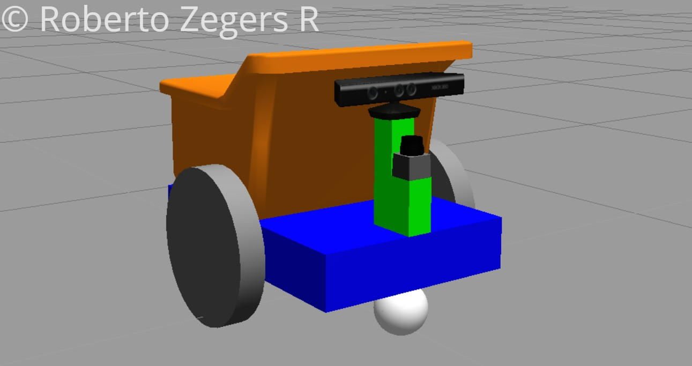
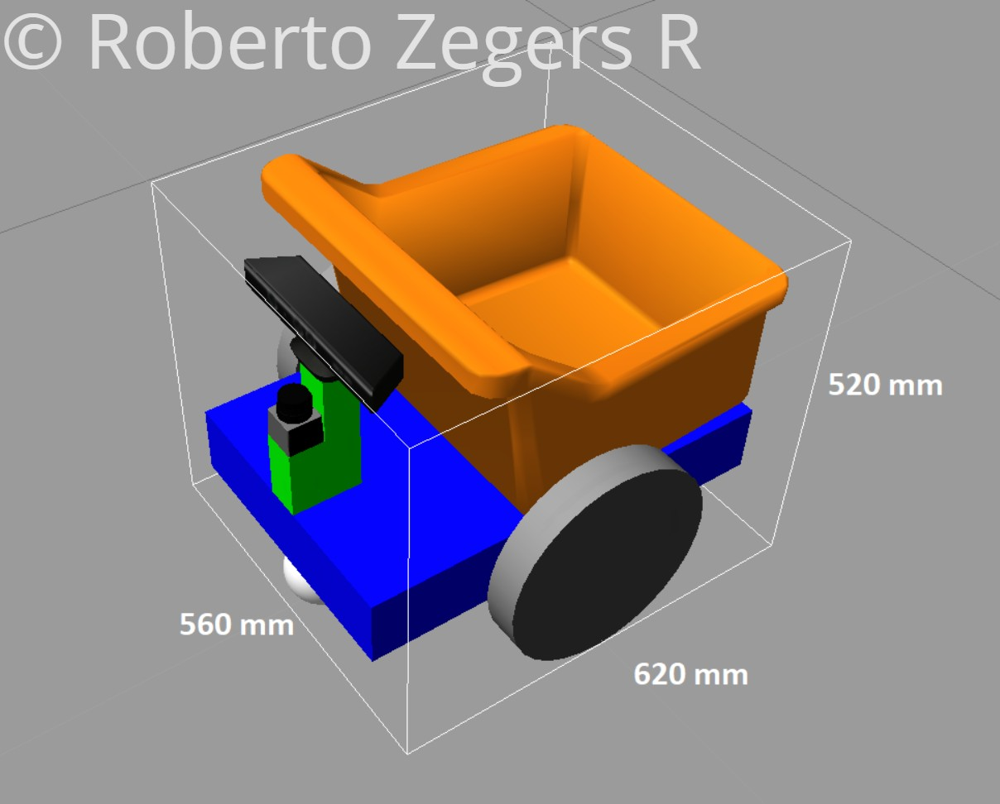
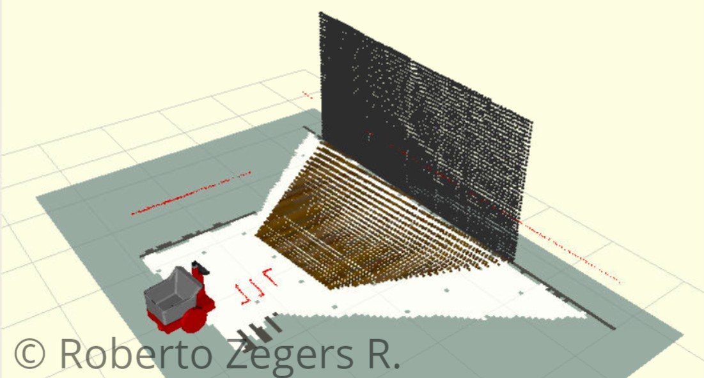

# ROS rtab_dumpster package
Author: Roberto Zegers R.

## Abstract
The package contains a URDF model of a differential drive robot equipped with an RGB-D camera.

## Brief description of the robot model
rtab_dumpster is a mobile robot base that has a differential drive configuration.
The robot model comprises the following components: a rigid chassis, two independently driven wheels fixed on a common horizontal axis and two passive support castor wheels one at the front and one at the back.
It also features a dump bin on top of its chassis. Additionally, both a laser scanner and a RGBD-camera are included in an elevated position in order to improve/maximize the sensors field of view.  
The main skills required for developing this robot model include the following: joint and link modeling with **URDF and XACRO**, integration of **Gazebo plugins** to provide the URDF model with sensors and actuators, **CAD modelling** of mesh files with Fusion 360 and version control with **GIT**.

Fig.1 Image of the robot model in Gazebo  

Fig.2 Size of the robot model's bounding box LENGTH x WIDTH x HEIGHT = 620 x 560 x 520mm  

Fig.3 The scene displayed by Rviz on startup showing the proper configured depth sensor  

## Default topics
+ Image Topic: /camera/rgb/image_raw
+ Depth Image Topic: /camera/depth/image_raw
+ Laser Scan Topic: /scan
+ Movement Commands: /cmd_vel

## Repository architecture
### Directories :
+ **urdf/** : (required) contains the files that generate the robot model and provide simulated actuators and sensors
+ **meshes/** : (required) contains the mesh files that are part of the geometry of that robot
+ **config/** : (optional) contains YAML files that store the Navigation Stack configuration files for the robot
+ **rviz/** : (optional) contains Rviz configuration settings for displaying the robot model
+ **launch/** : (optional) contains launch file for running the robot model in Gazebo
+ **worlds/** : (optional) contains scene/environment files for Gazebo
+ **maps/** : (optional) contains the occupancy grid based maps required for navigation

### Robot model files :
+ **dumster.xacro** : the xacro file that generates the urdf description file of the robot
+ **dumster.gazebo** : file accompanying the .xacro file, it contains the gazebo specific plugins that provide an interface to control the robot and simulate sensors

## Direct usage:

- Clone this repository into a ROS catkin workspace
- Build and source the workspace
- To launch this package including Rviz: `roslaunch rtab_dumpster demo.launch`

If you want to move the robot using a keyboard you will also need to start a teleop node.
To run the robot with the Navigation Stack type in a new window: `roslaunch rtab_dumpster amcl.launch`

This package has only been tested on Ubuntu 16.04 LTS with ROS Kinetic and Gazebo 7.0 and 7.15.
